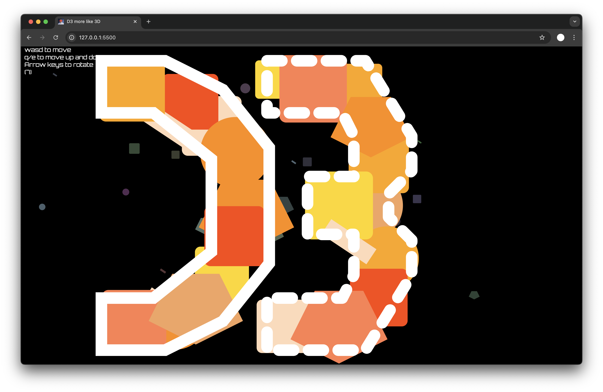
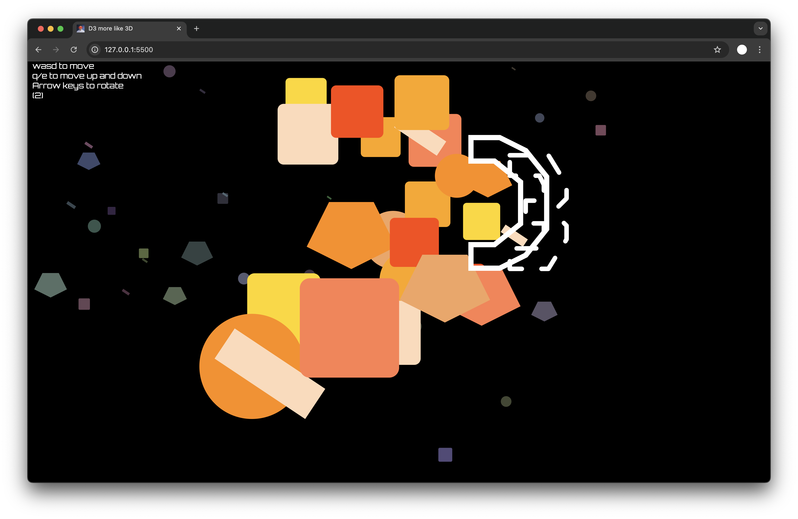
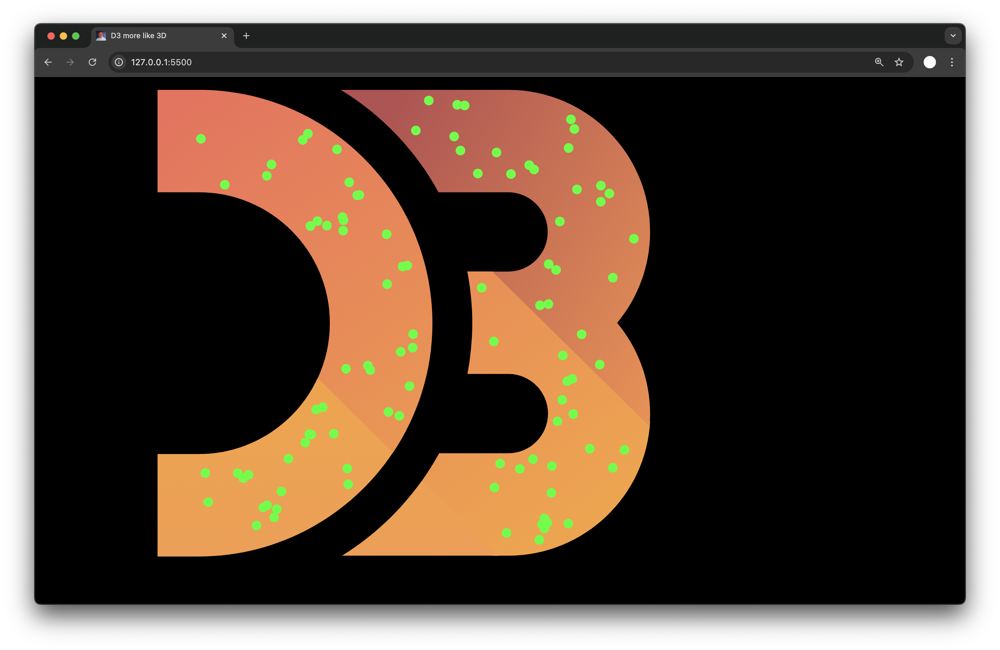
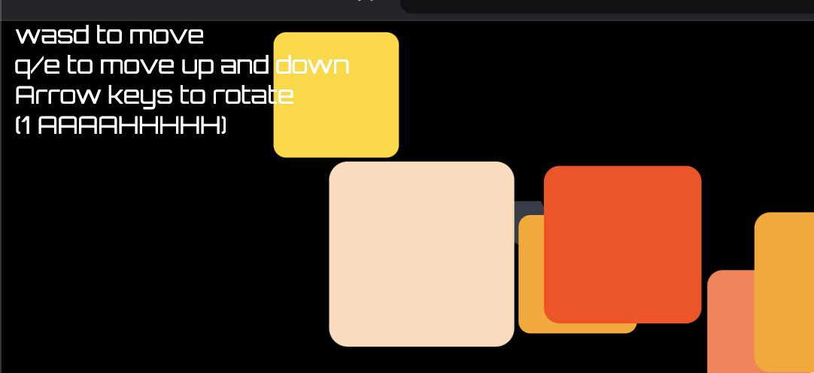

D3 More Like 3D
===
### https://s-leirbag.github.io/a1-ghd3/
An interactive 3d presentation of the d3 logo for WPI's Data Visualization course.  
Move with WASD, EQ, Arrow Keys!  





Baseline Achievements
---
I got to learn a ton about d3 and SVG!

I used a variety of shapes including circles, rectangles, lines, path, polygons, and different colors.

I added interesting attributes like rounded corners and a dashed line.

I didn't use any starter code. I used AI to give me example d3 code to learn from and implement my own way.

I wanted to implement animations but I couldn't because I refresh the screen to get interactive 3d movement.

Technical Achievements
---
I implemented pseudo-3d graphics. I used a 3d framework from an old Scratch project of mine, but Scratch's coordinate system is totally different so I essentially had to do the math again from scratch.

This was also challenging since I had to scale the d3 points and shapes properly to give a 3d effect, e.g.:

```javascript
svg
  .append("circle")
  .attr("cx", obj.drawX + screenWidth / 2)
  .attr("cy", obj.drawY + screenHeight / 2)
  .attr("r", costumeWidth / 2)
  .attr("fill", obj.color);
  ...
```

I also learned to generate points within an SVG, I experimented with this but didn't put it in the final product:
(The green points are points randomly generated within the svg of the d3 logo)



Design Achievements
---
I designed the d3 logo by using shapes in 3d space. I did this by temporarily overlaying the screen with the d3 logo as I placed shapes on the screen. It was tedious but rewarding to see it come together!

I made some design decisions like adding a polygon and a path outline to the d3 letters to make them clearer.

I also added shapes in the background to give more texture.

I added instructions for ease of use with a special font and a countdown timer to indicate when the instructions would disappear.



Overall there is a lot of potential for 3d, interactive data visualization. I'd like to explore it more in the future!